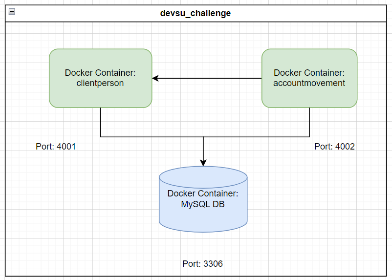

# Microservicios de Devsu Challenge

Estos microservicios han sido desarrollado utilizando una arquitectura hexagonal sin capa de aplicacion con Spring Boot. 
El modelo de dominio consta de tres entidades principales: Cliente (client), Cuenta (account), y Movimiento (movement).

## Requerimientos

Para ejecutar este microservicio, se requiere una base de datos MySQL. Se sugiere utilizar un contenedor Docker para facilitar la configuración. Puedes iniciar un contenedor MySQL con la siguiente línea de comando:

docker run --detach --env MYSQL_ROOT_PASSWORD=challengepassword --env MYSQL_USER=devsu_user --env MYSQL_PASSWORD=challengepassword --env MYSQL_DATABASE=devsu_challenge --name mysql --publish 3306:3306 mysql:8-oracle

### Configuración

La capa de persistencia utiliza Spring Data JPA para interactuar con la base de datos. Se han creado repositorios para cada una de las entidades del modelo de dominio.
Nota: puede suceder que cuando iniciamos los servicios el JPA no encuentre las tablas generara un error por lo que simplemente debemos reiniciar los servicios e intentarlo nuevamente
#### Modelo de Dominio

+----------------+         +-------------+
|   person       |         |    client   |
+----------------+         +-------------+
| id (PK)        | <------ | id (PK, FK) |
| address        |         | client_id   |
| age            |         | password    |
| gender         |         | status      |
| identification |         +-------------+
| name           |
| phone          |
+----------------+
+-----------------+         +----------------+
|   account       |         |  movement      |
+-----------------+         +----------------+
| id (PK)         |         | id (PK)        |
| account_balance |         | account_number |
| account_number  |         | account_type   |
| account_type    |         | date_movement  |
| id_client       |         | final_balance  |
| identification  |         | initial_balance|
| name            |         | movement_detail|
| status          |         | status         |
+-----------------+         +----------------+

##### Documentacion API swagger
Con una dependencia: springdoc-openapi-starter-webmvc-ui habilitamos el swagger

Swagger para clientperson: http://localhost:4001/swagger-ui/index.html
Swagger para movementperson: http://localhost:4002/swagger-ui/index.html

###### Despliegue
Nos ubicamos en dentro de la ruta /Docker y ejecutamos el comando:
docker-compose -p devsu_challenge up --build -d

Este comando levantara toda la solucion creara 3 servicios:
-mysqlDataBase
-apiClientPerson
-apiAccountMovement

Nota: existe una posibilidad de que cuando los contenedores de las apis se desplieguen generen un error, esto sucede debido a que no encuentra las tablas en la primera iteracion, por lo que los microservicios generaran un error y estaran en un estado EXITED en el Campo Status al ejecutar el comando docker ps

Seria algo asi:

Ejecutamos el comando:

docker ps

Esto me lista los contenedores desplegados y su status

CONTAINER ID   IMAGE                             COMMAND                  CREATED          STATUS          PORTS                               NAMES
6381486e4bd2   devsu_challenge-accountmovement   "java -jar accountmo…"   24 seconds ago   Up 22 seconds   0.0.0.0:4002->4002/tcp              apiAccountMovement
32a72b48f035   devsu_challenge-clientperson      "java -jar clientper…"   24 seconds ago   Up 23 seconds   0.0.0.0:4001->4001/tcp              apiClientPerson
a39258e252f9   mysql:latest                      "docker-entrypoint.s…"   25 seconds ago   Up 23 seconds   0.0.0.0:3306->3306/tcp, 33060/tcp   mysqlDataBase

Si en algun momento en el campo STATUS sale algo diferen a Up, debemos reiniciar los contenedores con el siguiente comando:
  docker restart --Container ID--
Para ejemplos practivos seria:
  docker restart 6381486e4bd2
  y 
  docker restart 32a72b48f035
Esperamos que los servicios inicien y listo ya estamos listos para consumir los servicios

###### Consumo de Servicios

En esta Coleccion se tiene
Clients
 - Create Client
 - List Clients
 - Search Client By Identification
 - Update Client
 - Delete By Identification
Account
 - Create Account
 - List Accounts
 - Search Account By AccountNumber
 - Update Account
 - Delete By AccountNumber
Movement
 - Create Movement
 - List Movements
 - Search Movement By Id
 - Update Movement
 - Delete By Id
Reports
 - Reports
Health API ClientPerson
Health API AccountMovement

###### URL GIT 
https://github.com/spenilla2/devsu